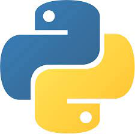

<h1 align="center">Hi 👋, I'm Usama</h1>
<h3 align="center">A passionate back-end developer (python/Django)</h3>

<h3 align="left">Here are some highlights of my journey:</h3>

- 📅 I'm currently doing the **#100DaysOfCode** challenge from June 1, 2023, to September 10, 2023!
  - 💻 Each day, I'm making commits to my GitHub repositories ([**ecommerce**](https://github.com/usamaalzomor/e-commerce) and [**ServiceLink**](https://github.com/usamaalzomor/servicelink)) as part of the challenge.
  - 📝 I'm posting daily updates in the commit messages with what I've learned.
  - 💡 This challenge is helping me to improve my coding skills, learn new technologies, and be more consistent.

- 🌱 I'm presently deepening my understanding of [**Python**](https://www.python.org/doc/), [**Django**](https://docs.djangoproject.com/en/4.2/), [**DRF**](https://www.django-rest-framework.org/) and [**MySQL**](https://www.mysql.com/)

- 👯 Now I'm seeking potential collaborators for a project called [**ServiceLink**](https://github.com/usamaalzomor/servicelink)

- 💬 Ask me about [**Python**](https://www.python.org/doc/), [**Django**](https://docs.djangoproject.com/en/4.2/)

- 📫 you can reach me on **usama.alzomor@gmail.com**

- 📄 Here is my updated CV [**Usama's CV**](https://drive.google.com/file/d/1ttGjATcDzGP2wqybgfkpUzmCapEJnxGC/view?usp=sharing)

- 😎 Fun fact about me is this [**'I am an amateur singer'**](https://www.facebook.com/100001326958457/videos/3215626085158258/) but this is in **aside** of my work

<h3 align="left">Experienced in:</h3>

 
<a href="https://www.djangoproject.com/" target="_blank" rel="noreferrer">  </a><a href="https://www.mysql.com/" target="_blank" rel="noreferrer">   

<h3 align="left">Have experience working with:</h3>

 
</a>     

<h3 align="left">Connect with me:</h3>

&nbsp;

<!-- ### Hi there, Hope you are well.

### I am a Python & Django Developer

---

- 🌱 I’m currently learning Django by doing an E-commerce project called storefront
- 👯 I’m seeking for an internship or a junior role as a Django developer
- 💬 Ask me about any thing you need, and I promise if I have any information I will till you about
- ⚡ Fun fact: I am a singer but it's something in aside of my work

### Languages and Tools:

    &nbsp;&nbsp;
    &nbsp;&nbsp;
    &nbsp;&nbsp;
    &nbsp;&nbsp;
    &nbsp;&nbsp;
    &nbsp;&nbsp;
    &nbsp;&nbsp;
    &nbsp;&nbsp;
    &nbsp;&nbsp;

 -->

<!--
**usamaalzomor/usamaalzomor** is a ✨ _special_ ✨ repository because its `README.md` (this file) appears on your GitHub profile.

Here are some ideas to get you started:

- 🔭 I’m currently working on ...
- 🌱 I’m currently learning ...
- 👯 I’m looking to collaborate on ...
- 🤔 I’m looking for help with ...
- 💬 Ask me about ...
- 📫 How to reach me: ...
- 😄 Pronouns: ...
- ⚡ Fun fact: ...
-->
